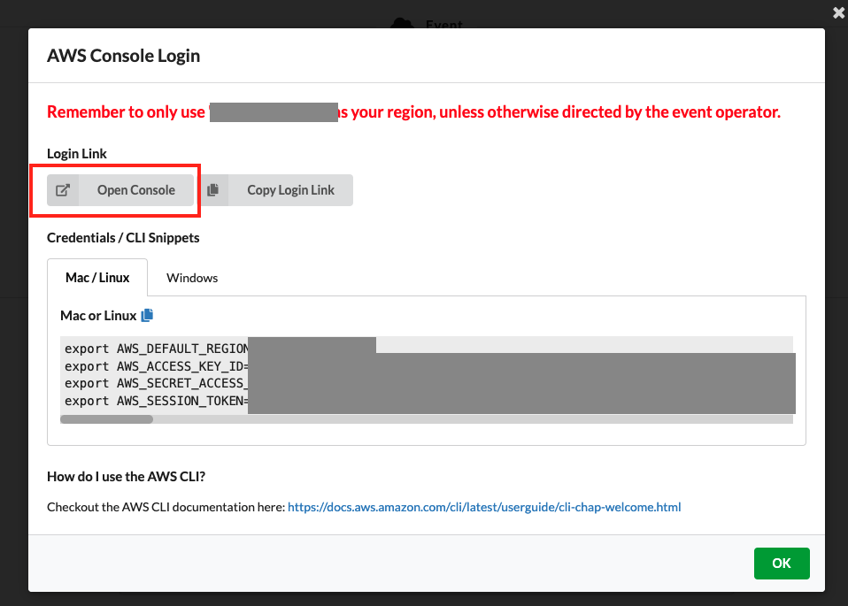

# Getting Started

For this workshop you’ll get access to a temporary AWS Account already pre-configured with Amazon SageMaker Studio. Follow the steps in this section to login to your AWS Account and download the workshop material.

### 1. To get started navigate to - https://dashboard.eventengine.run/login 
Use e920-174536be64-f7 as the event hash

Click on Accept Terms & Login

### 2. Click on Email One-Time OTP (Allow for up to 2 mins to receive the passcode)

### 3. Provide your email address

### 4. Enter your OTP code

### 5. Click on AWS Console

### 6. Click on Open AWS Console (

### 7. In the AWS Console click on Amazon SageMaker

