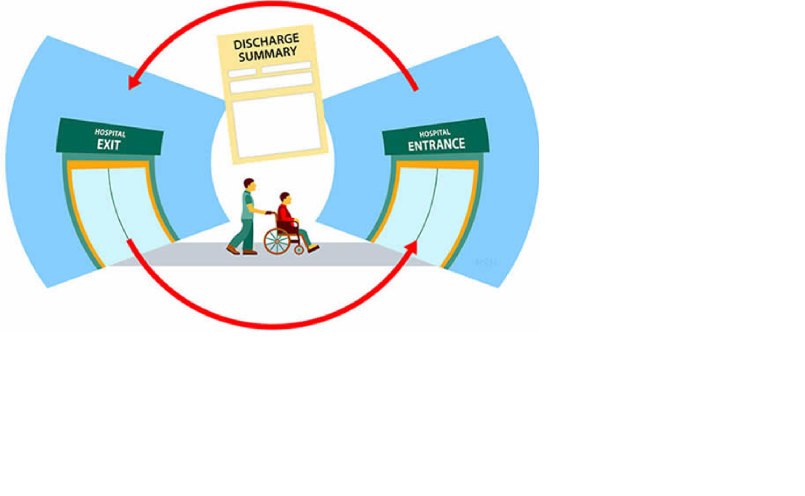

## Predict Hospital Readmission
### Predict Diabetic Patients' Hospital Readmission

Identify the factors that lead to the high readmission rate of diabetic patients within 30 days post discharge and correspondingly predict the high-risk diabetic-patients who are most likely to get readmitted within 30 days.

Hospital readmission is an important contributor to total medical expenditures and is an emerging indicator of quality of care. Diabetes, similar to other chronic medical conditions, is associated with increased risk of hospital readmission. hospital readmission is a high-priority health care quality measure and target for cost reduction, particularly within 30 days of discharge. The burden of diabetes among hospitalized patients is substantial, growing, and costly, and readmissions contribute a significant portion of this burden. Reducing readmission rates among patients with diabetes has the potential to greatly reduce health care costs while simultaneously improving care.

It is estimated that 9.3% of the population in the United States have diabetes , 28% of which are undiagnosed. The 30-day readmission rate of diabetic patients is 14.4 to 22.7 % . Estimates of readmission rates beyond 30 days after hospital discharge are even higher, with over 26 % of diabetic patients being readmitted within 3 months and 30 % within 1 year. Costs associated with the hospitalization of diabetic patients in the USA were $124 billion, of which an estimated $25 billion was attributable to 30-day readmissions assuming a 20 % readmission rate. Therefore, reducing 30-day readmissions of patients with diabetes has the potential to greatly reduce healthcare costs while simultaneously improving care.


### Experiment:

* SageMaker DataWrangler to perform exploratory data analysis (EDA) and feature engineering on the feature columns.
* SageMaker Autopilot to train and tune an optimal multi-class classifier.

## Pre-requisites:

* We need to ensure dataset (loan default prediction) for ML is uploaded to a data source.
* Data source can be any one of the following options:
    * S3
    * Athena
    * RedShift
    * SnowFlake

## Data Source
For this experiment the Data Source will be Amazon S3   


### Dataset:

The dataset is required before we begin, ensure that you have downloaded it by following the instructions below.

### Downloading the dataset, and notebooks

* Ensure that you have a working Amazon SageMaker Studio environment and that it has been updated. If you do not, follow the instructions here.
* Open an Amazon SageMaker Studio terminal to import the datasets and notebook into Amazon SageMaker Studio
  * Select File / New / Terminal from the menu at the top of Amazon SageMaker Studio


* Next, download the dataset to SageMaker Studio notebook using the commands below. Execute the commands within the opened Terminal

```
mkdir lcnc 
cd lcnc
sudo yum install -y unzip
curl 'https://static.us-east-1.prod.workshops.aws/public/c0c6cca9-375e-4d43-94ec-6b09cd521bcd/static/resources/hcls/diabetic.zip' --output diabetic.zip
unzip diabetic.zip
```
The commands that you have run in the terminal, will create a folder called lcnc, and then download and install the unzip utility. After that a copy of the data is downloaded and unzipped it into the lcnc/diabetic/ folder.


* Notice the file explorer on the right has been updated with a new folder called lcnc. Double click on the folder and double click on the folder diabetic.
* Double click on the file called explore-data.ipynb. Amazon SageMaker may prompt you to select a kernel and image. If it does select Data Science as the image and Python 3 as the Kernel, as shown here:


* You have now successfully downloaded the data and opened a notebook, we will now upload the data to your S3 bucket. Note: An Amazon S3 bucket was created for you when the Amazon SageMaker Studio environment was started.
* 
* From the menu select Run / Run All Cells to execute all the cells in the notebook. You will see a sample of the dataset printed to the screen.
* 
* The data structure is defined in the next section. However, before we continue, note the path to the various datasets. Your paths will be different to the ones in the image below. Please copy these paths as you will use them later. An example of a path is s3://sagemaker-eu-west-1-112233445566/datasets/diabetic_readmission.csv


### Review of the dataset:

* The dataset represents 10 years (1999-2008) of clinical care at 130 US hospitals and integrated delivery networks. It includes over 15 features representing patient and hospital outcomes.
  * The data contains such attributes as race, gender, age, admission type, time in hospital, number of lab test performed, HbA1c test result, diagnosis, number of medication, diabetic medications, number of outpatient, inpatient, and emergency visits in the year before the hospitalization, etc.
    * The dataset contains ~70,000 rows and 15 feature columns.


In the next section we will import the datasets into Data Wrangler via the SageMaker Studio User Interface (UI).

