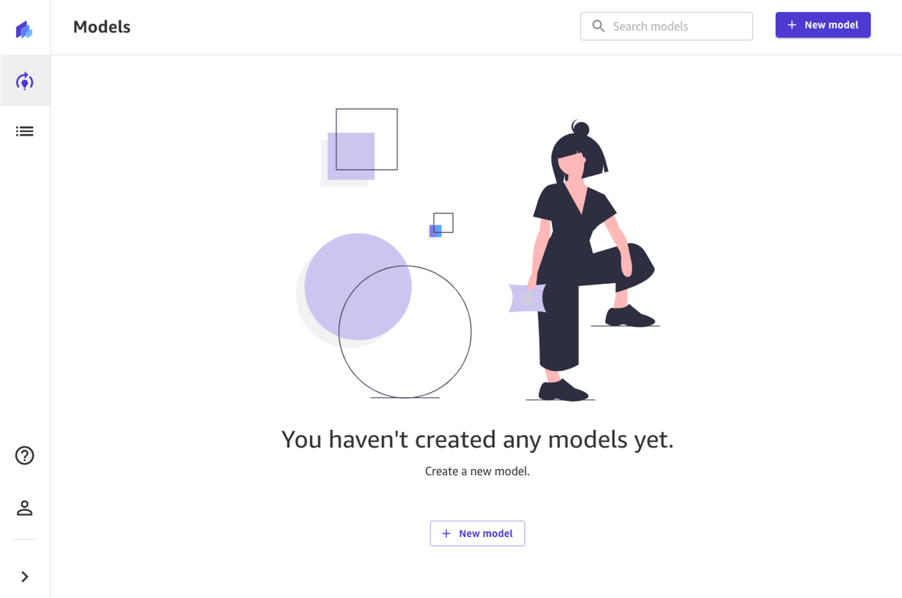
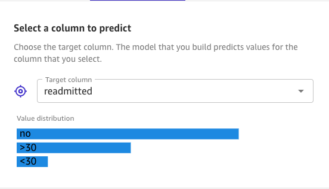
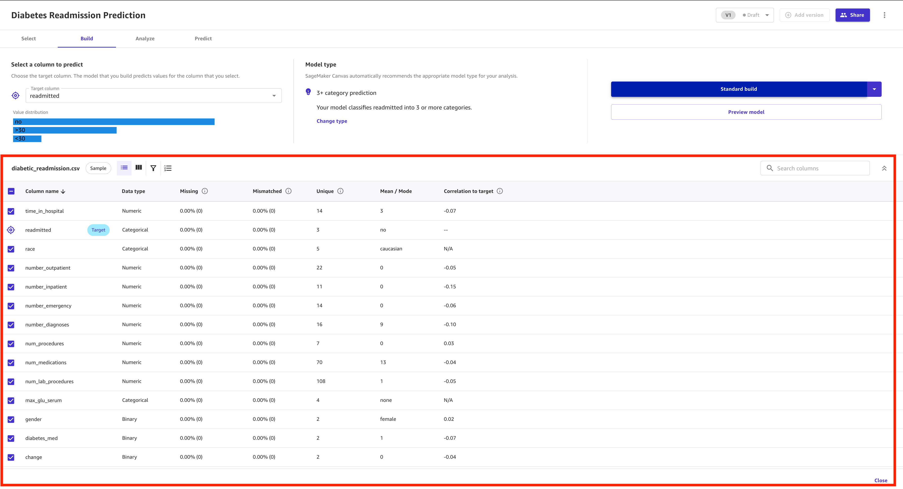
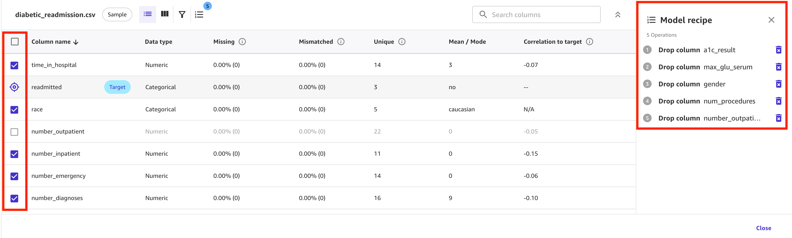
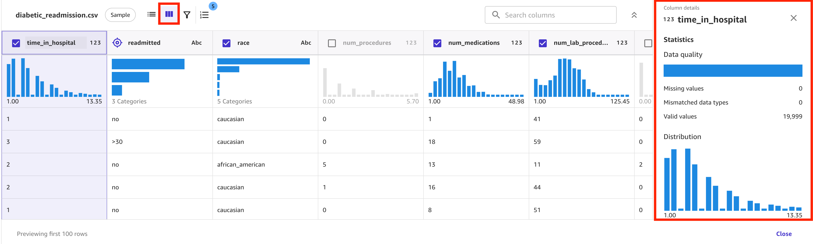
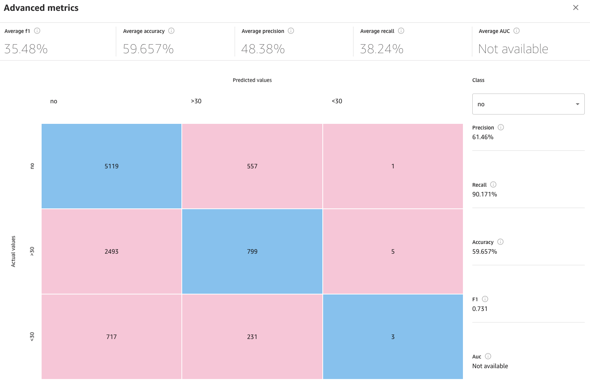
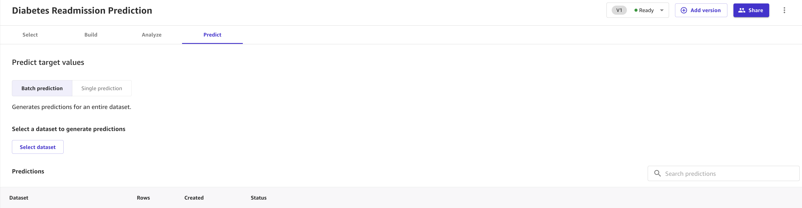

# Diabetic Patient Readmission Prediction using Amazon SageMaker

## Overview

In this lab, you will learn how to use Amazon Sagemaker Canvas and analyze a historical dataset representing patient and hospital outcomes, build a machine learning (ML) to predict hospital readmission without writing a single line of code. The model has to predict whether the high-risk diabetic-patients is likely to get readmitted to hospital after previous encounter within thirty days or after thirty days or not. Since this use case deals with multiple outcomes, this ML problem is called "Multi-class Classification".

## About Diabetes Readmission

Hospital readmission is an important contributor to total medical expenditures and is an emerging indicator of quality of care. Diabetes, similar to other chronic medical conditions, is associated with increased risk of hospital readmission.

The sample dataset we are going to use in this lab is a sampled version of the "Diabetes 130-US hospitals for years 1999-2008 Data Set" 

(Beata Strack, Jonathan P. DeShazo, Chris Gennings, Juan L. Olmo, Sebastian Ventura, Krzysztof J. Cios, and John N. Clore, “Impact of HbA1c Measurement on Hospital Readmission Rates: Analysis of 70,000 Clinical Database Patient Records,” BioMed Research International, vol. 2014, Article ID 781670, 11 pages, 2014. ). It contains historical data including over fifteen features with patient and hospital outcomes. The dataset contains approximately ~50,000 rows

##  Import the dataset in Canvas and Create model

The first step is to download the sample dataset. You can download it from [here](diabetic-readmission.csv)

In SageMaker Canvas, select 'Datasets' from the menu on the left and then click on 'Import'. Click on the 'Upload' button and the drag and drop the diabetes-readmission.csv file you've just downloaded, then click Upload at the bottom of the page. Once the upload is complete, you can now click the top-right Close button. You should now see the file uploaded to SageMaker Canvas.

### Create Model in SageMaker Canvas

Now, let's go to Amazon SageMaker Canvas back to the Models section of the web page, by clicking the second button on the left menu.

Click on + New model, and provide a name to your model.

If this is the first time creating a Canvas model, you will be welcomed by an informative pop-up about how to build your first model in 4 simple steps. You can read this through, then come back to this guide.

## Import dataset to the model

In the Model view, you will see four tabs, which correspond to the four steps to create a model and use it to generate predictions: Select, Build, Analyze, Predict. In the first tab, Select, click the radio button to import the diabetes-readmission.csv dataset and choose "Select Dataset" to import the dataset.

Canvas will automatically move to the Build phase. In this tab, choose the target column, in our case readmitted. This target represents whether the patient has gotten readmitted to hospital after previous encounter within thirty days or after thirty days or nothing was recorded (values: "no", "<30" and ">30").

The dataset we used for the demo is imbalanced resulting in lower accuracy.

This is what you want to train your model to predict. Canvas will automatically detect that this is a 3+ Category prediction problem. If the wrong model type is detected, you can change it manually with the Change type link at the center of the screen.

In the bottom half of the screen, you can take a look at some of the statistics of the dataset, including missing and mismatched values, unique vales, mean and median values.

This can also be used to drop some of the columns, if we don't want to use them for the prediction, by simply un-checking them with the left checkbox. A description of each column is provided below. Let us drop a1c_result, max_glu_serum, gender, num_procedures, number_outpatient columns for example as their impact is lower.

You can also dive deeper in to each columns by going to Grid View where upon clicking on column header. It opens Column details with data around statistics and distribution.

## Building and Training a ML Model

Before building model, you can Preview model that analyses dataset and gives us Estimated Accuracy and column impact.

After analyzing the dataset and modifying columns based on impact, you can choose to build as either do Standard Build - which usually takes over 2-4 hours giving better accuracy or 'Quick Build' which usually takes 2-5 minutes however compromising on accuracy. Please note that you cannot share Quick Build models.  We will use the Quick Build.

SageMaker Canvas does some level of pre-processing and data balancing when building a Standard Model. Some of the algorithms used by SageMaker Canvas already handle imbalanced data through some of their hyper-parameters.

Now, we wait approximately 5-15 minutes hours. This could vary for you. Once done, Canvas will automatically move to the Analyze tab, to show us the results of our quick training. The analysis performed using quick build estimates that our model is able to predict the right outcome 59.6% of the time.

Let's focus on the first tab, Overview. This is the tab that shows us the Column impact, or the estimated importance of each column in predicting the target column. In this example, the number_diagnoses column has the most significant impact in prediction followed by number_inpatient.

Don't worry if the numbers in the below images differ from yours. Machine Learning introduces some stochasticity in the process of training models, which can lead to different results to different builds.

When we move to the Scoring portion of our analysis, we can see a plot representing the distribution of our predicted values with respect to the actual values. Notice that most customers are unlikely to get readmitted. If you want to learn more about how Canvas uses SHAP baselines to bring explainability to Machine Learning, you can check the "[Evaluating Your Model's](https://docs.aws.amazon.com/sagemaker/latest/dg/canvas-evaluate-model.html) Performance in Amazon SageMaker Canvas" section 
of the Canvas documentation, as well as the page for [SHAP Baselines for Explainability ](https://docs.aws.amazon.com/sagemaker/latest/dg/clarify-feature-attribute-shap-baselines.html)

You are most interested in the patients who are likely to get readmitted and how well the model predicts this subset of patients. To take a closer look at the results, you can click on the Advanced metrics link on the right.

This will display a matrix that allows you to more closely examine the results. In machine learning, this is referred to as a confusion matrix.

For 'not getting readmitted' class, select class no from the right panel.

In machine learning, the accuracy of the model is defined as the number of correct predictions divided over the total number of predictions. The blue boxes represent correct predictions that the model made against a subset of test data where there was a known outcome. In this case there were 8426 correct predictions out of 13824 overall, which resulted in 61% accuracy.

However, you are more interested in measuring how well the model predicted patient readmission cases. The model correctly predicted 5119 customers would not get readmitted (True Positive - TP). However, it incorrectly predicted that 3210 customers would get readmitted, when in fact they would (False negatives - FN). In machine learning, a ratio used to measure this is TP / (TP + FN). This is referred to Recall. The advanced metrics page calculates and displays a recall score of 38.24% for this model.

## Using the model to generate predictions

You can use this model to run some predictions, by clicking on the button Predict at the bottom of the page

Now that the model is trained, let's use for some predictions. Select Predict at the bottom of the Analyze page, or choose the Predict tab.

Now, choose Select dataset, and choose the diabetes-readmission.csv. Next, choose Generate predictions at bottom of the page. Canvas will use this dataset to generate our predictions. Although it is generally a good idea not to use the same dataset for both training and testing, we're using the same dataset for the sake of simplicity. After a few seconds, the prediction is done. You can click on the eye icon to see a preview of the predictions by hovering over the, or click the download button to download a CSV file containing the full output. SageMaker Canvas will return a prediction for each row of data and the probability of the prediction being correct.

You can also choose to predict one by one values, by selecting Single prediction instead of batch prediction. Canvas will show you a view where you can provide manually the values for each feature, and generate a prediction. This is ideal for situations like what-if scenarios: e.g. how does the price change if the house is older? What if it's closer to the ocean? How about one with more rooms?

Congratulations! You've now completed the lab