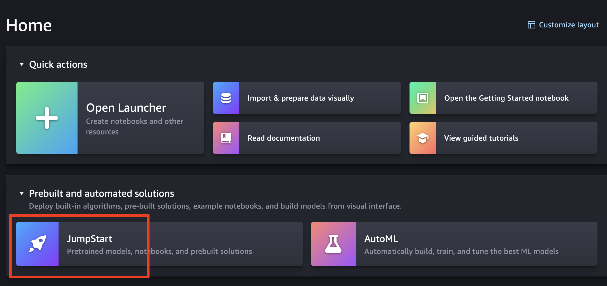
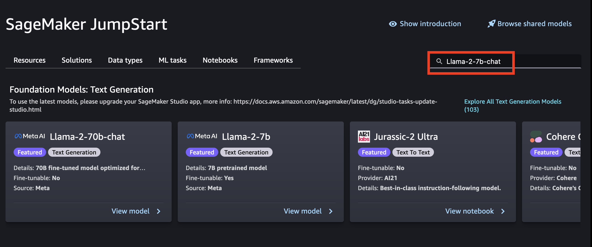
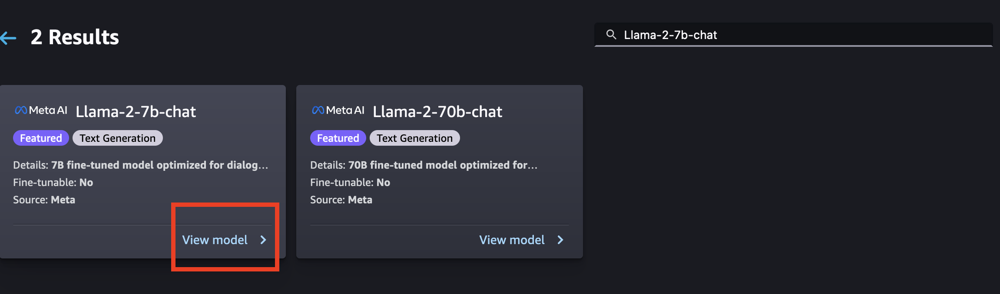
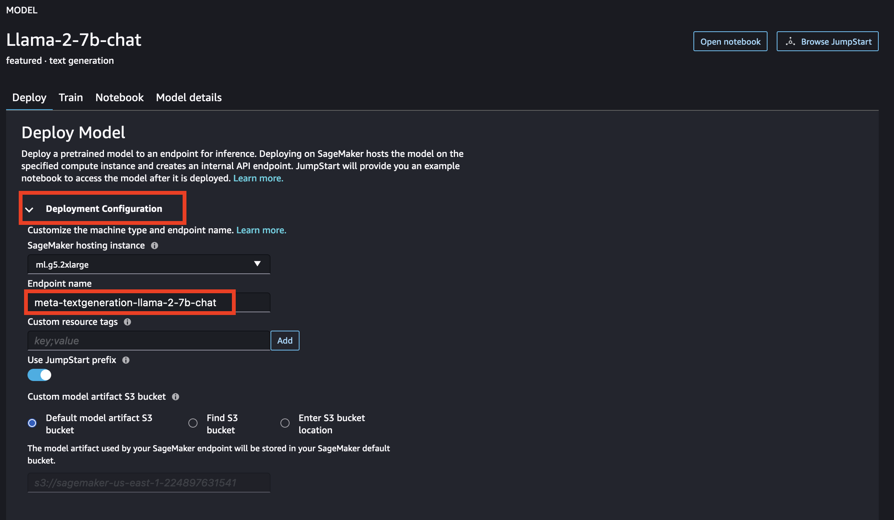
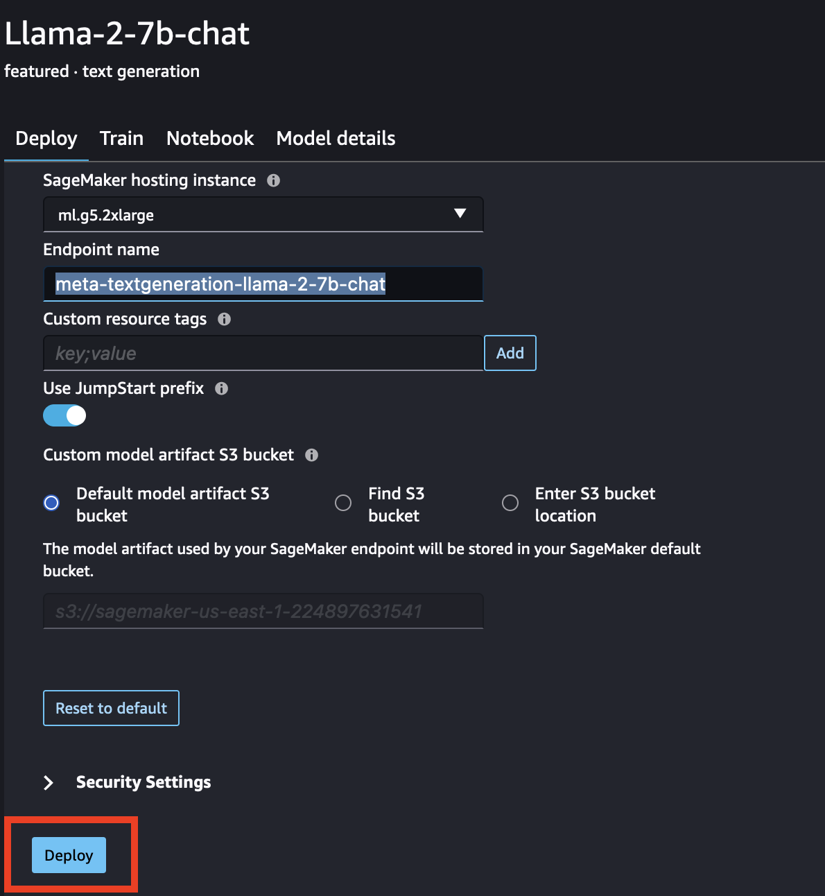

Welcome to the first lab for Large Language models. In this lab, we will first deploy a large language model using SageMaker Jumpstart and then use that model to try out multiple education related use cases.

The notebooks for this lab are at https://github.com/aws-samples/amazon-sagemaker-immersion-day-for-research/tree/main/10.%20Generative_AI/1.%20Education_QnA

Use a ml.t3.medium instance and Data Science kernel for this notebook.

## SageMaker Jumpstart for Large Language Models
SageMaker JumpStart provides pretrained, open-source models for a wide range of problem types to help you get started with machine learning. You can access the pretrained models, solution templates, and examples through the JumpStart landing page in Amazon SageMaker Studio. You can also access JumpStart models using the SageMaker Python SDK.

Amazon SageMaker JumpStart offers state-of-the-art, built-in foundation models for use cases such as content writing, code generation, question answering, copywriting, summarization, classification, information retrieval, and more. Use JumpStart foundation models to build your own generative AI solutions and integrate custom solutions with additional SageMaker features. 

In the accompanying notebook, you will first deploy a model using the jumpstart python SDK and then run the following  use cases using multiple sources:

1. Keyword generation
2. Summarization 
3. Checking for correct answers
4. Generation of QnA pairs
5. ask questions such as 
   1. What is the storyline?
   2.  who is the main character? 
   3.  what happens in the end?
   4.  What is the main gist of the paper?
   5.  What is the problem being solved?
   6.  What is the conclusion of the paper?

#### Set Up Llama-2-7b-chat endpoint
1. Go to 'Home' page in SageMaker Studio.
2. Click 'JumpStart' tab in the Home page (Within the 'Prebuilt and automated solutions' section). 

3. Inside 'JumpStart' page, search for 'Llama-2-7b-chat' in the top right search bar. 

4. Click 'View model' for 'Llama-2-7b-chat'. This will lead you to the page for this model.

5. In the model page, under the section for 'Deploy Model', expand the tab 'Deployment Configuration' and modify the 'Endpoint name' to be 'meta-textgeneration-llama-2-7b-chat'. Leave the rest of the settings as default.

6. Click 'Deploy'.

7. Wait till the 'Endpoint Status' to be 'In Service'. Then the deployment process has finished. You can continue with the notebook.