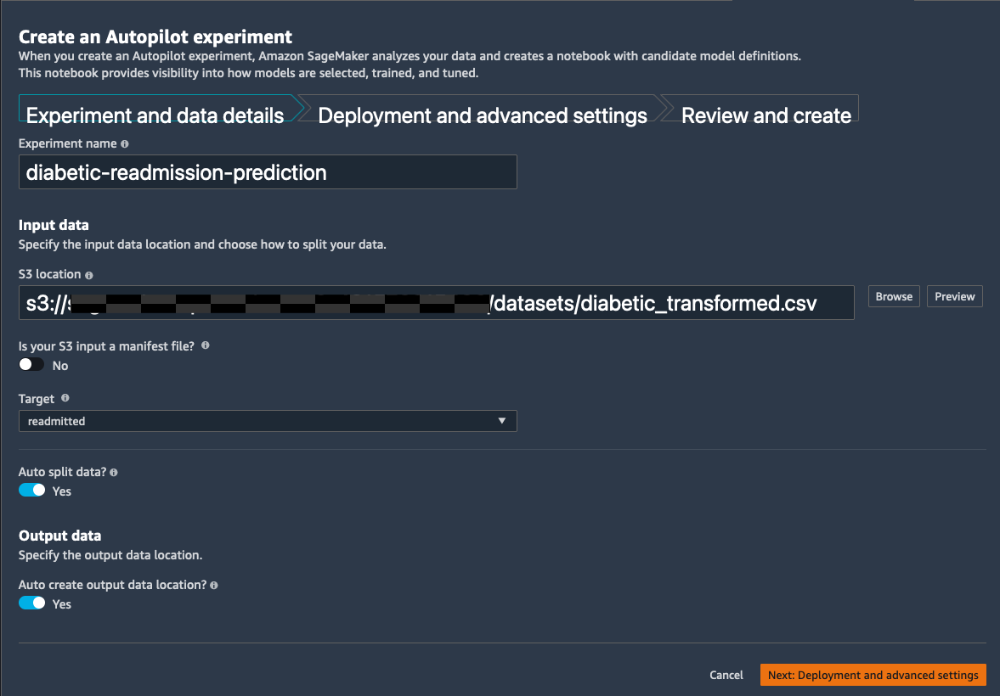
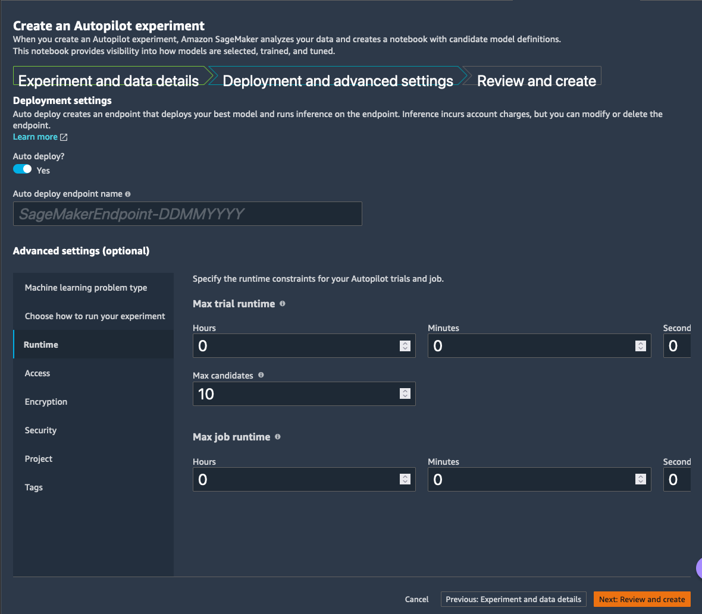
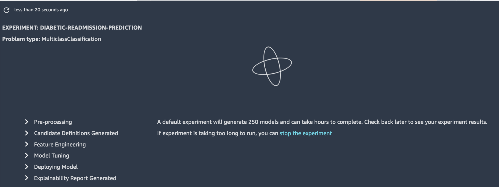
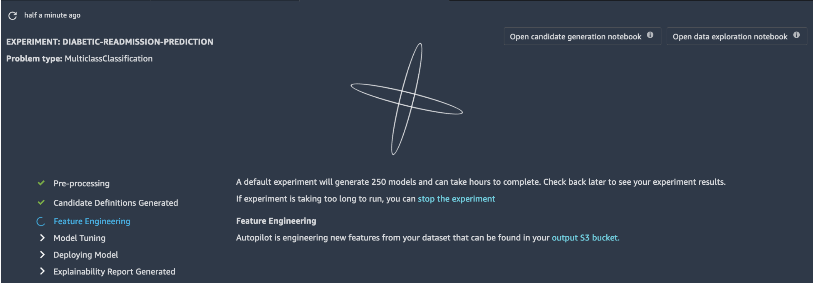
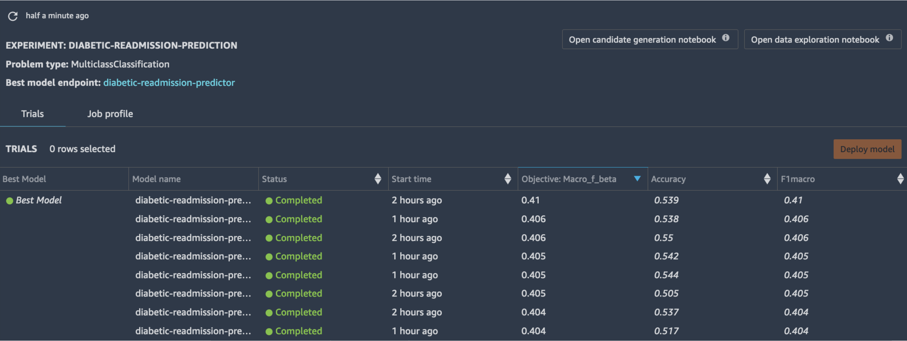
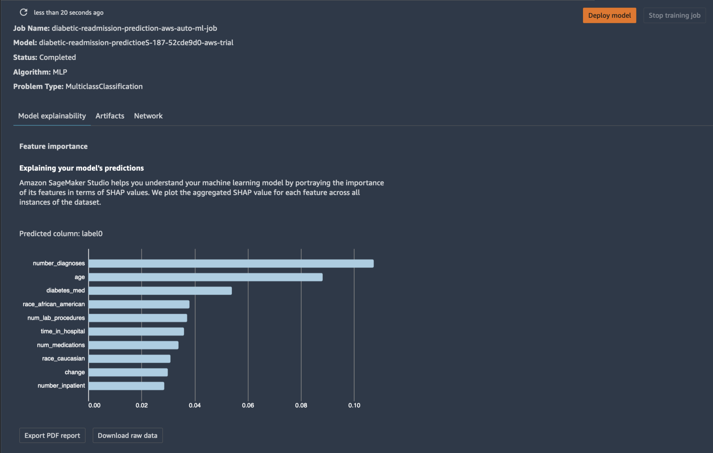

# SageMaker Autopilot
## Creating an Autopilot Experiment

* SageMaker Autopilot automatically creates feature engineering pipelines, selects algorithms suitable for the machine learning problem type, trains and tunes several candidate models, before arriving at an optimal model.
* Steps carried out by Autopilot are as follows:
  * Automatic data pre-processing and feature engineering
    * Automatically handles missing data.
    * Provides statistical insights about columns in your dataset.
    * Automatically extracts information from non-numeric columns, such as date and time information from timestamps.
    * Automatically handles imbalance in data.
    * Automatically creates 10 feature engineering (FE) pipelines most adapted to your problem. Those FE pipelines consist of FE transformations coming from both native scikit-learn, and custom scikit-learn-compatible FE transformations invented and open-sourced by Amazon.
  * Automatic ML model selection
    * Automatically infers the type of predictions that best suit your data, such as binary classification, multi-class classification, or regression
    * Explores high-performing algorithms such as gradient boosting decision tree, feed-forward deep neural networks, and logistic regression, and trains and optimizes hundreds of models based on these algorithms to find the model that best fits your data.
    * Automatically cross validates the data to flag problems like over-fitting or selection bias and gives insights on how the model will generalize to an independent dataset.
  * Automatic Model HPO
    * Runs epsilon-greedy bandit tests for each of the FE pipelines, and progressively invests more HPO budget on the most rewarding FE pipeline.
  * Model leader-board
    * Automatically ranks the candidate models based on user provided success metric such as accuracy, precision, recall, or area under the curve (AUC).
    * Lets user automatically deploy the model for real-time inference that is best suited to their use case.
  * Explainability
    * Automatic notebook generation showcasing the various candidates (pipelines) for feature engineering.
    * Automatic notebook generation for exploratory data analysis.
    * Uses SageMaker Clarify under the covers to provide model agnostic feature attribution metrics using SHAPley values.
  * Automatic data and model provenance
    * Uses SageMaker Experiments behind the scenes to automatically capture data and model lineage for each of the candidate models trained during the process.

## Autopilot
* For the Autopilot experiment, we will be using the transformed features exported via Data Wrangler to S3. From the Autopilot interface, specify the experiment settings as shown in the screenshots below and hit Create Experiment.

* Once the Autopilot experiment starts, you will see it complete stages one by one starting with the pre-processing stage as shown below.

* Once the candidate definitions (i.e., 10 feature engineering pipelines) are generated, you will see 2 buttons that are enabled on the right upper corner of the workspace. Clicking those buttons take you to generated notebooks showing the code for feature engineering and data exploration.

* Once all the stages are completed, you can see ranked list of all the trained models by Autopilot along with the captured metrics.

* You can dive into the details of individual models by right clicking on the model and choosing Open in model details.

* Once the experiment is completed, Autopilot will automatically deploy the best model as a real-time REST endpoint.
* The Autopilot generated candidate definitions and exploratory data analysis notebooks can be found in the autopilot folder. Note this folder was created at the start of the workshop, when you downloaded the diabetic.zip file

## Online Inference (Real-time)
* Code sample showing how to invoke the real-time endpoint for online inference with example payloads are contained in the notebook real-time-inference.ipynb in the autopilot folder downloaded at the start of this workshop.

## Offline Inference (Batch)
* Code sample showing how to kick off a SageMaker Batch Transform job for offline batch inference is contained in the batch-inference.ipynb in the autopilot folder downloaded at the start of this workshop.